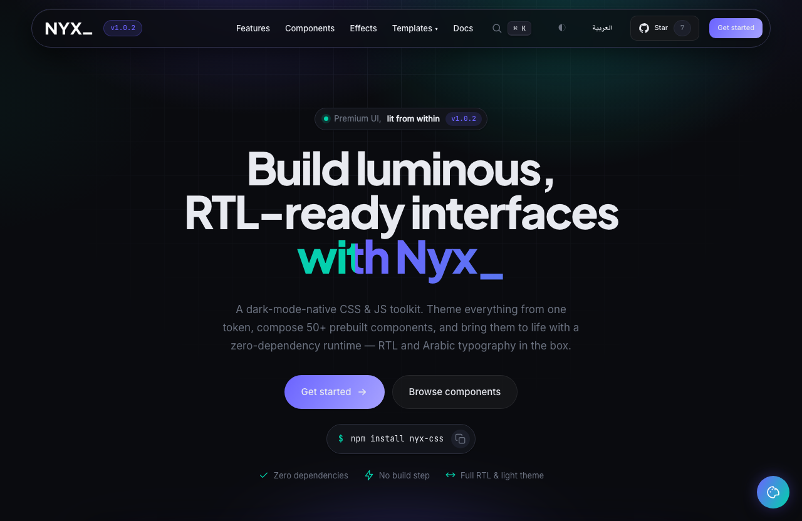

<div align="center">

<picture>
  <source media="(prefers-color-scheme: dark)" srcset="assets/logo-white.png" />
  
</picture>

### The dark‑native design system with **Luminous Depth**

*Every interactive element feels lit from within.*
A zero‑dependency CSS **+** JS component framework — fully themeable, light **&** dark, with first‑class **RTL** and Arabic typography.

[](https://www.npmjs.com/package/nyx-css)
[](LICENSE)


**`npm i nyx-css`** &nbsp;·&nbsp; [Live demo](https://fadyehabamer.github.io/NYX/) &nbsp;·&nbsp; [Documentation](https://fadyehabamer.github.io/NYX/docs/docs.html) &nbsp;·&nbsp; [Components](#-components) &nbsp;·&nbsp; [Theming](#-theming) &nbsp;·&nbsp; [العربية](https://fadyehabamer.github.io/NYX/docs/docs.ar.html)

<a href="https://fadyehabamer.github.io/NYX/"></a>

</div>

---

> **Think Bootstrap — but dark by default, opinionated for the SaaS era, and bilingual.**
> One signature trait sets it apart: **Luminous Depth**. Glow, glass, and gradient are baked into the tokens, so every surface reads as if backlit.

## ✦ Why Nyx

- 🌑 **Dark‑native, light‑ready** — both themes ship built‑in; flip with one attribute.
- 🎨 **Themeable to the core** — every value is a `--nyx-*` custom property. Retint the whole system with `color-mix()`; no recompile.
- 🌍 **RTL & Arabic, first‑class** — logical properties throughout, a dedicated RTL layer, Arabic faces by default (IBM Plex Sans Arabic + Aref Ruqaa), and the self‑hosted **Thmanyah** family bundled in `fonts/`.
- 🧩 **100+ components** — buttons to command palettes, charts, timelines, carousels, data grids, MENA/Arabic regional widgets, and signature pieces you won't find elsewhere.
- ⚡ **Tiny vanilla runtime** — UMD `window.Nyx`, declarative `data-nyx-*`, auto‑inits on load. Most pages need no JS at all.
- 📦 **À‑la‑carte or all‑in‑one** — ship the full bundle or just the modules you import. Zero dependencies (except Google Fonts).

## ⚡ Quick start

```bash
npm i nyx-css
```

Then import the stylesheet and runtime in your app (Vite · webpack · Next · Nuxt):

```js
import 'nyx-css/nyx.css';   // styles
import 'nyx-css/nyx.js';    // runtime → window.Nyx
```

…or drop two files into any page — **no build step:**

```html
<!DOCTYPE html>
<html lang="en" data-theme="dark">
<head>
  <!-- fonts (the only external dependency) -->
  <link href="https://fonts.googleapis.com/css2?family=Inter:wght@400;500&family=JetBrains+Mono:wght@400;500;700&family=Plus+Jakarta+Sans:wght@600;700;800&display=swap" rel="stylesheet">

  <!-- 1 · the framework -->
  <link rel="stylesheet" href="nyx.css">
</head>
<body class="nyx nyx-reset">

  <button class="nyx-btn nyx-btn-primary">Hello, Nyx</button>

  <!-- 2 · the runtime (tabs, modals, toasts, scrollspy…) -->
  <script src="nyx.js"></script>
</body>
</html>
```

> **Building for Arabic / RTL?** Add the Arabic faces to the fonts link — `&family=IBM+Plex+Sans+Arabic:wght@400;500;600;700&family=Aref+Ruqaa:wght@400;700` — and Nyx switches to them automatically under `dir="rtl"`.

**From a CDN** (no install — `@1` tracks the latest 1.x):

```html
<link rel="stylesheet" href="https://cdn.jsdelivr.net/npm/nyx-css@1/nyx.min.css">
<script src="https://cdn.jsdelivr.net/npm/nyx-css@1/nyx.min.js"></script>
```

Two body classes: **`nyx`** (canvas, base type, focus rings, scrollbars — required) and **`nyx-reset`** (opt‑in `box-sizing: border-box` + reset — recommended).

## 🎨 Theming

Override any token, anywhere downstream — that's the whole API.

```css
:root {
  --nyx-accent:   #ff5d8f;   /* swap the violet for pink   */
  --nyx-accent-2: #29e0c4;   /* secondary / success accent */
  --nyx-radius:   12px;      /* round everything a bit more */
}
```

Tokens cover color, the type scale (`--nyx-fs-xs` … `--nyx-fs-3xl`), spacing (`--nyx-s1` … `--nyx-s9`, 4px base), radii, shadows, and the signature `--nyx-glow`. Prebuilt accent themes ship in the box: **violet · emerald · rose · amber**.

### Light & dark · RTL

```html
<html data-theme="light">   <!-- default is "dark" -->
<html dir="rtl">            <!-- every component mirrors -->
```
```js
Nyx.toggleTheme();   // flips + persists to localStorage
Nyx.toggleDir();     // RTL ⇄ LTR
```

## 🧠 JavaScript

`nyx.js` is UMD (attaches global **`Nyx`**, supports `require`) and auto‑initializes on `DOMContentLoaded`.

**Declarative** — most behaviors need no script:

```html
<button data-nyx-toggle="modal"   data-nyx-target="#myModal">Open modal</button>
<button data-nyx-toggle="drawer"  data-nyx-target="#myDrawer">Open drawer</button>
<button data-nyx-toggle="command">Search (⌘K)</button>
<nav class="nyx-sidebar" data-nyx-spy>…</nav>           <!-- scrollspy -->
<table class="nyx-table nyx-table-sortable">…</table>   <!-- click to sort -->
```

**Imperative:**

| Method | Description |
| --- | --- |
| `Nyx.toast(message, type, ms)` | Toast. `type`: `info` \| `success` \| `warning` \| `danger`. |
| `Nyx.openModal(target)` / `openDrawer(target)` | Open an overlay (`'#id'` or element). |
| `Nyx.close(target)` / `closeAll()` | Close one / all overlays. |
| `Nyx.openCommandPalette()` | Open the ⌘K palette. |
| `Nyx.init(root)` | Re‑wire `data-nyx-*` after injecting markup. Idempotent. |

```js
Nyx.toast('Saved ✓', 'success');
Nyx.openModal('#invite');
```

**Keyboard:** `⌘K` / `Ctrl+K` opens the command palette; `Esc` closes any overlay.

## 🧩 Components

> **Layout** `nyx-grid` `nyx-col-*` `nyx-flex` `nyx-stack` `nyx-container` `nyx-divider`
> **Typography** `nyx-display` `nyx-h1`–`nyx-h6` `nyx-lead` `nyx-gradient-text` `nyx-code`
> **Buttons** `nyx-btn` + `-primary` `-secondary` `-ghost` `-danger` `-glass` `-glow` `-icon` `-outline-*` · sizes `-sm` `-lg` · `-loading` · `nyx-btn-group`
> **Cards** `nyx-card` + `-glass` `-gradient` `-interactive` `-stat` `-feature`
> **Forms** `nyx-input` `nyx-textarea` `nyx-select` `nyx-input-group` `nyx-search` `nyx-toggle` `nyx-checkbox` `nyx-radio` `nyx-range` `nyx-float`
> **Navigation** `nyx-navbar` `nyx-sidebar` `nyx-breadcrumb` `nyx-tabs` `nyx-nav-pills` `nyx-pagination` `nyx-dropdown` `nyx-command-palette`
> **Feedback** `nyx-badge` `nyx-alert` `nyx-toast` `nyx-progress` `nyx-skeleton` `nyx-spinner` `nyx-status-bar`
> **Data** `nyx-table` `nyx-table-sortable` `nyx-data-grid` `nyx-kpi-row` `nyx-list-group`
> **Overlays** `nyx-modal` `nyx-drawer` `nyx-tooltip` `nyx-popover` `nyx-accordion` `nyx-collapse` `nyx-carousel` `nyx-ratio`
> **Signature** `nyx-spotlight` `nyx-orbit` `nyx-chip` `nyx-timeline` `nyx-meter` `nyx-gradient-border` `nyx-avatar` `nyx-marquee` `nyx-segment` `nyx-rating` `nyx-empty` `nyx-banner` `nyx-dropzone`
> **Charts** `nyx-chart-bars` `nyx-chart-line` `nyx-chart-donut` `nyx-chart-pie` `nyx-chart-legend` — zero‑dep CSS + SVG, accent‑driven
> **Backgrounds** `nyx-bg-grid` `nyx-bg-dots` `nyx-bg-mesh` `nyx-bg-gradient` `nyx-bg-beams` `nyx-bg-noise` `nyx-bg-stars` `nyx-bg-squares`
> **Motion** `nyx-anim-fade` `nyx-anim-up`/`-left`/`-right` `nyx-anim-blur` `nyx-anim-float` `nyx-anim-pulse-glow` · scroll‑reveal + delays
> **Code** `nyx-code-block` — titled window, syntax tokens, one‑tap copy via `data-nyx-copy`
> **Commerce** `nyx-product` `nyx-cart-item` `nyx-coupon` `nyx-pay` `nyx-order` `nyx-price` `nyx-address`
> **Regional · MENA** `nyx-countdown` `nyx-prayer-times` `nyx-qibla` `nyx-zakat` `nyx-hijri-convert` `nyx-delivery` `nyx-bnpl` `nyx-invoice` (ZATCA QR) `nyx-national-address`

Every component has its own page — with live examples, a class reference, and a search‑filterable sidebar — in the **[live docs](https://fadyehabamer.github.io/NYX/docs/docs.html)** (and **[العربية](https://fadyehabamer.github.io/NYX/docs/docs.ar.html)** in Arabic).

## 📁 Project layout

| Path | Purpose |
| --- | --- |
| `nyx.css` / `nyx.min.css` | The framework — design tokens + every component (full + minified). |
| `nyx.js` / `nyx.min.js` | The runtime — declarative `data-nyx-*` + the imperative `Nyx.*` API. |
| `components/*.css` | À‑la‑carte modules generated by `build.js` (each needs `tokens.css`). |
| `build.js` | Splits `nyx.css` into `components/` + `nyx.bundle.css`, and minifies. |
| `index.html` · `index.ar.html` | Marketing landing page (English / Arabic RTL). |
| `docs.html` · `docs.ar.html` · `docs.js` | Documentation SPA — a hash router renders one component per route from the registry. |

**Adding a doc page** needs no new HTML — just push an object to the `PAGES` array in `docs.js`:

```js
{
  id: 'tooltips', group: 'Components', title: 'Tooltips',
  summary: 'CSS-only hover tooltips on four sides.',
  sections: [{ title: 'Four sides', demo: '<span class="nyx-tooltip">…</span>' }],
  classes: [['nyx-tooltip', 'Hover target wrapper.']]
}
```

Each section's `demo` renders **both** as the live example and as its (escaped, highlighted) code snippet — so they never drift.

## 🌐 Browser support

Modern evergreen browsers. Theming leans on `color-mix()` and `:has()`, so the practical baseline is **Chrome / Edge 111+, Safari 16.4+, Firefox 113+** (mid‑2023). Also uses CSS custom properties, grid, `backdrop-filter`, and `IntersectionObserver`, and respects `prefers-reduced-motion`.

## 📜 License

[MIT](LICENSE) © Nyx. The self‑hosted **Thmanyah** Arabic typeface (`fonts/thmanyah/`) is © [ثمانية (Thmanyah)](https://font.thmanyah.com/) and remains under its own license.

<div align="center"><sub>Built with Luminous Depth · dark‑first · bilingual</sub></div>
